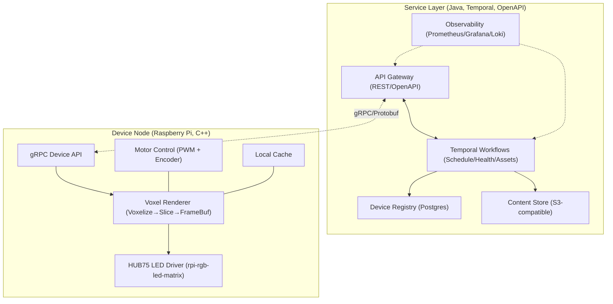
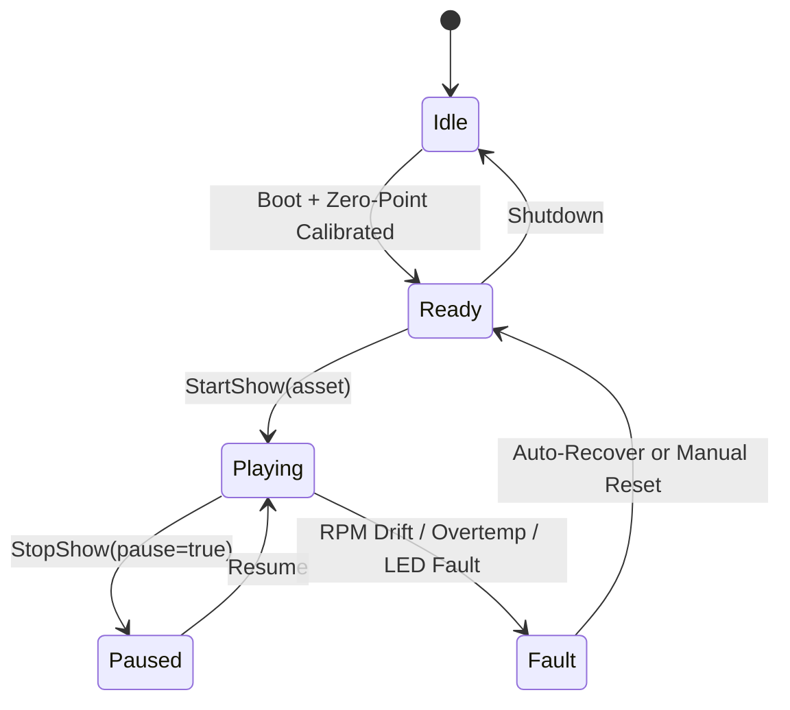
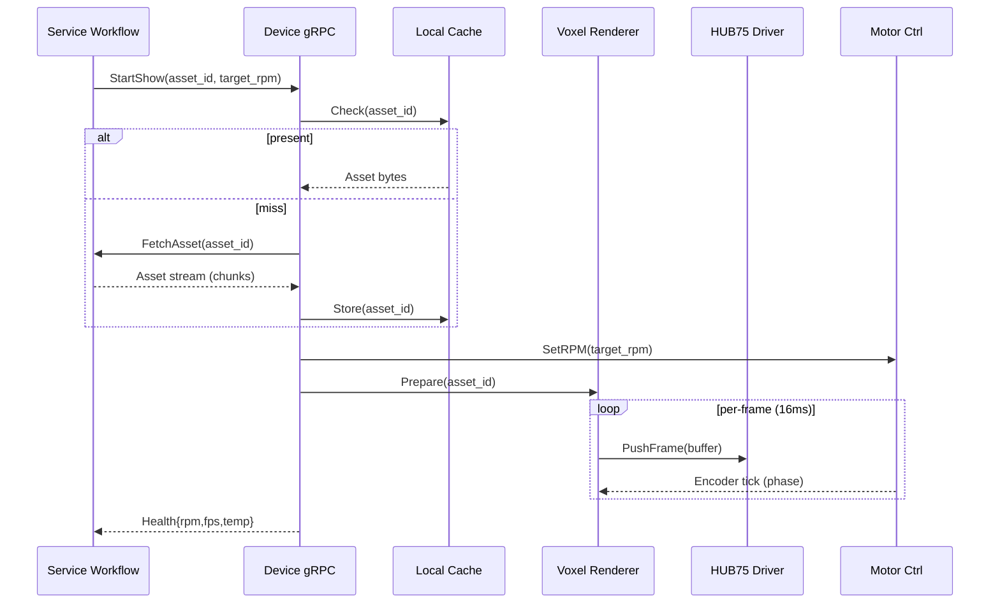
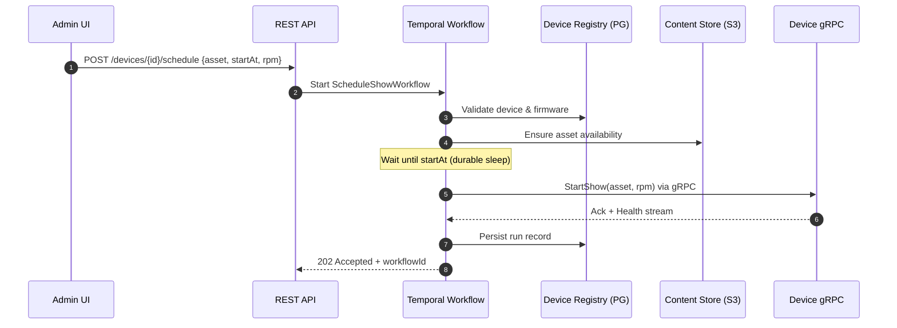
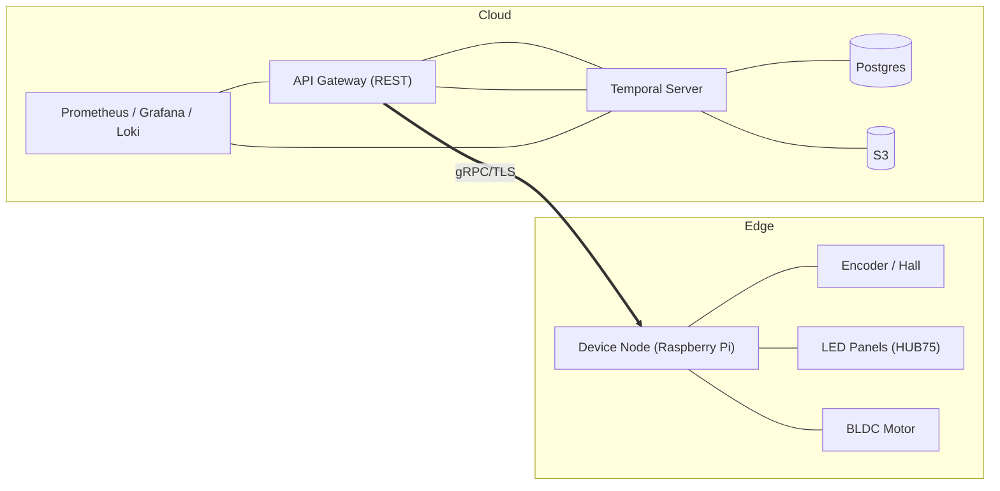

# Vortex Guru — Engineering Design Document

**Author**: Peter Goshomi  
**Date**: Sept 2025  
**Version**: Draft v1.1 (Markdown + Mermaid)

---

## 1. Overview
Vortex Guru is a volumetric avatar display system that projects 3D content using a rotating LED matrix (HUB75 panels) synchronized with a motor. The system consists of:

- **Device Node**: Raspberry Pi (C++) controlling motor, LED panels, and rendering.  
- **Service Layer**: Java/Temporal orchestration (scheduling, health, asset workflow) exposed via REST (OpenAPI) and gRPC to devices.

The design separates **real-time rendering** from **durable orchestration**.

---

## 2. Goals
- Stable real-time playback (30–60 FPS) with low jitter.  
- Remote orchestration (start/stop, asset selection, scheduling).  
- Durable workflows (retries, recovery, audit).  
- Extensible APIs for admin/clients (OpenAPI), device link via gRPC.  

---

## 3. Architecture Overview



---

## 4. Device Design (C++)

### 4.1 Hardware
- Raspberry Pi 4 Model B (4–8GB RAM)  
- HUB75 LED Matrix Panels (64×64, chained)  
- BLDC motor + encoder, hall-effect zero-point sensor  
- Power: 5V/12V rails, UPS module for safe shutdown  

### 4.2 Software Modules
1. **Motor Control** — PWM via `pigpio`, closed-loop RPM with encoder feedback  
2. **LED Driver** — `rpi-rgb-led-matrix`, double-buffered frames  
3. **Voxel Renderer** — voxelize → slice → frame buffer (Eigen/OpenGL ES optional)  
4. **Networking Layer** — gRPC server (`SetRPM`, `StartShow`, `StopShow`, `UploadAsset`, `GetHealth`)  
5. **System Daemon** — `systemd` unit, watchdog, **local asset cache** for offline mode  

### 4.3 Device Control State Machine



### 4.4 Data Flow (Device)



---

## 5. Service Design (Java)

### 5.1 Components
- **Temporal Workflows**
  - `ScheduleShowWorkflow`: orchestrates show start/stop, timing, retries  
  - `DeviceHealthWorkflow`: periodic health query, alerting on anomalies  
  - `AssetDistributionWorkflow`: upload/replicate, checksum verify  
- **API Gateway (OpenAPI/REST)**
  - `POST /devices/{id}/schedule`, `GET /devices/{id}/health`, `POST /assets`, `GET /shows/history`  
- **Storage**
  - **Postgres** (device registry, show history, asset metadata)  
  - **S3** (asset blobs)  
- **Observability**
  - **Prometheus + Grafana** (metrics), **Loki/ELK** (logs), alerts to Slack/PagerDuty  

### 5.2 Workflow-Orchestration Sequence (Service-centric)



---

## 6. Interfaces

### 6.1 Device gRPC (proto excerpt)

```proto
syntax = "proto3";

service VortexDevice {
  rpc SetRPM(RpmRequest) returns (Ack);
  rpc StartShow(ShowRequest) returns (Ack);
  rpc StopShow(StopRequest) returns (Ack);
  rpc UploadAsset(stream AssetChunk) returns (Ack);
  rpc GetHealth(HealthRequest) returns (HealthResponse);
}

message RpmRequest { int32 rpm = 1; }
message ShowRequest { string asset_id = 1; int32 target_rpm = 2; }
message StopRequest { bool pause = 1; }
message AssetChunk { bytes data = 1; string asset_id = 2; int32 seq = 3; }
message HealthRequest {}
message HealthResponse { int32 rpm = 1; int32 fps = 2; float temp = 3; string fw = 4; }
message Ack { bool ok = 1; string msg = 2; }
```

### 6.2 Service REST (OpenAPI excerpt)

```yaml
paths:
  /devices/{id}/schedule:
    post:
      summary: Schedule a show on device
      parameters:
        - name: id
          in: path
          required: true
          schema: { type: string }
      requestBody:
        required: true
        content:
          application/json:
            schema:
              $ref: '#/components/schemas/ScheduleShowRequest'
      responses:
        '202':
          description: Accepted (workflow started)
          content:
            application/json:
              schema:
                $ref: '#/components/schemas/ScheduleAck'

components:
  schemas:
    ScheduleShowRequest:
      type: object
      required: [assetId, startAt, rpm]
      properties:
        assetId: { type: string }
        startAt: { type: string, format: date-time }
        rpm: { type: integer, minimum: 60, maximum: 2400 }
    ScheduleAck:
      type: object
      properties:
        workflowId: { type: string }
        deviceId: { type: string }
        state: { type: string, enum: [scheduled, running, completed, failed] }
```

---

## 7. Non-Functional Requirements
- **Real-time**: ≤16 ms/frame (60 FPS), ≤1 ms encode/phase jitter  
- **Durability**: workflow retries with exponential backoff, idempotent device commands  
- **Security**: TLS everywhere, mTLS for device links; rotate device certs  
- **Scalability**: 1K+ devices, sharded workflow task queues  
- **Extensibility**: versioned gRPC/REST (`v1`), backward-compatible schemas  
- **Maintainability**: separate repos; CI/CD with hardware-in-the-loop tests on the device branch  

---

## 8. Risks & Mitigations
- **Motor sync drift** → encoder feedback + phase-locked render; auto-recalibrate on drift  
- **Overtemp/PSU brownouts** → thermal sensors plus throttling; gracefully degrade; UPS SIGPWR handling  
- **Network loss** → device caches last N shows, reconnection backoff, local schedule  
- **Frame latency spikes** → double-buffering, precomputed slices, CPU affinity for render thread  
- **Asset corruption** → checksums (SHA-256), length-prefix chunking, resume uploads  

---

## 9. Deployment & Environments



**Envs**: `dev` (simulated device), `staging` (few real devices), `prod` (fleet)  
**Config**: all via env vars/Consul; device uses read-only root + overlay for cache  

---

## 10. Implementation Notes

### 10.1 Device (C++)
- **Build**: CMake, cross-compile toolchain for Pi  
- **Libs**: `pigpio`, `rpi-rgb-led-matrix`, `protobuf`/`gRPC`, `Eigen`, optional OpenCV/GL ES  
- **Runtime**: `systemd` unit with watchdog and restart policy  
- **Testing**: GoogleTest + HIL tests that replay encoder traces; perf counters for FPS/jitter  

### 10.2 Service (Java)
- **Runtime**: Java 21 LTS  
- **Frameworks**: Spring Boot or Quarkus; Temporal Java SDK; OpenAPI Generator  
- **Storage**: Postgres (Flyway migrations), S3 (MinIO for dev)  
- **Observability**: Micrometer + Prometheus; structured JSON logs; tracing via OTEL  

---

## 11. Roadmap
- **Phase 1 (MVP)**: Single device; gRPC control; manual asset upload; heartbeat  
- **Phase 2**: Temporal scheduling; multi-device fan-out; health dashboards  
- **Phase 3**: CDN-like asset distribution; analytics; admin RBAC  
- **Phase 4**: Interactive avatars; gesture input; on-device ML pose fitting  

---

## 12. Appendices

### 12.1 Example `systemd` service (device)
```ini
[Unit]
Description=Vortex Device Service
After=network-online.target

[Service]
ExecStart=/usr/local/bin/vortex_device --config /etc/vortex/device.yaml
Restart=always
WatchdogSec=10
Environment=GPRC_TLS_CERT=/etc/vortex/certs/device.crt

[Install]
WantedBy=multi-user.target
```

### 12.2 Health Telemetry (JSON)
```json
{
  "deviceId": "pi-001",
  "timestamp": "2025-09-10T20:30:00Z",
  "rpm": 1200,
  "fps": 60,
  "tempC": 58.2,
  "voltage": 11.9,
  "errors": []
}
```
