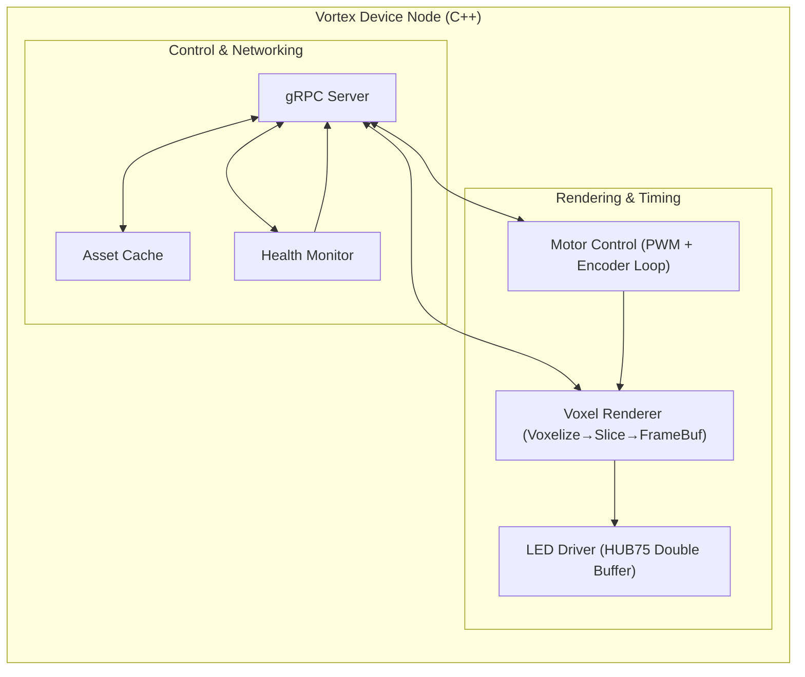
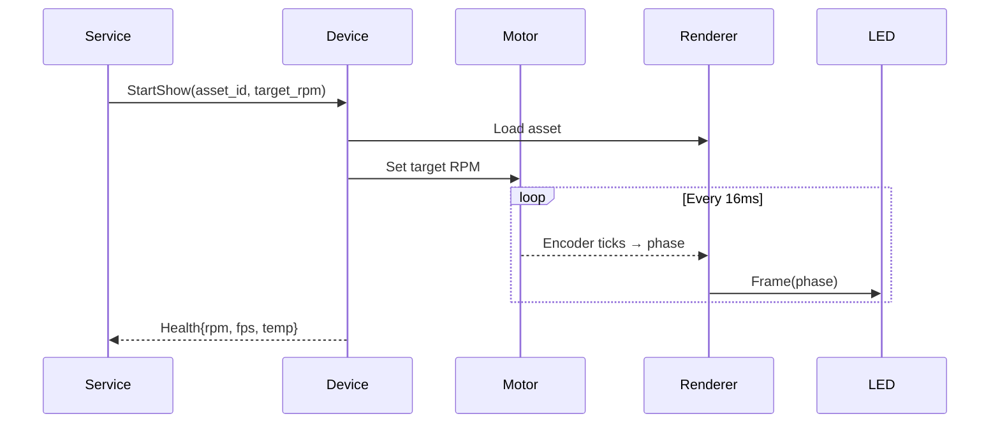

# Vortex Guru — Device Node (C++ on ESP32)
**Engineering Deep Dive: Voice-Activated Volumetric Node**  
*Version: Draft v2.0 (Jan 2026)*

---

## 1. Scope
The **Device Node** is responsible for **real-time volumetric rendering** and **hardware control**.  
It must:
- Spin the BLDC motor at a precise RPM (phase-locked to LED refresh).
- Render 3D assets into **voxel slices** and stream them to HUB75 LED panels.
- Accept **commands from the Service Layer** (start/stop shows, change RPM, upload assets).
- Provide **health telemetry** (RPM, FPS, temperature, errors).
- Operate reliably offline (last N cached shows, UPS integration).

---

## 2. High-Level Architecture


## 3. Hardware Interfaces
| Component      | Interface       | Notes                                      |
|----------------|-----------------|--------------------------------------------|
| **BLDC Motor** | PWM (GPIO)      | Controlled by `pigpio` or hardware PWM.    |
| **Encoder**    | GPIO interrupts | Counts ticks, used for RPM & phase.        |
| **HUB75 LED**  | Parallel GPIO   | Driven via `rpi-rgb-led-matrix`.           |
| **Sensors**    | I²C/SPI         | Temp/voltage sensors (e.g., INA219).       |
| **Storage**    | SD card + ext.  | Local cache in `/var/lib/vortex/assets`.   |
| **Network**    | Ethernet/WiFi   | TLS-secured gRPC channel to Service Layer. |

## 4. Software Modules
#### 4.1 Motor Control

- Uses PWM driver to spin BLDC at target RPM.
- Encoder ISR counts ticks → compute actual RPM & phase.
- Implements PID loop for stability.
- Exposes methods:
```c++
class MotorController {
public:
  bool init();
  void setTargetRPM(int rpm);
  int getCurrentRPM() const;
  void stop();
};
```
### 4.2 LED Driver

- Based on [rpi-rgb-led-matrix](https://github.com/hzeller/rpi-rgb-led-matrix)
- Double-buffered: while one frame is displayed, the next is prepared.
- Supports chaining multiple panels.
- Exposes:
```c++
class LedDriver {
public:
  bool init(int rows, int cols, int chain);
  void displayFrame(const std::vector<uint32_t>& pixels);
  void clear();
};
```
### 4.3 Voxel Renderer

- Converts 3D asset (mesh/point cloud) into 2D slices per rotation angle.
- Pipeline:
    1. Load asset (.obj, .ply, or custom format).
    2. Voxelize → 3D grid (N×N×N).
    3. Slice by angle (phase) → 2D bitmap.
    4. Push the frame to the LED driver.
- Exposes:
```c++
class VoxelRenderer {
public:
    bool loadAsset(const std::string& path);
    Frame getNextFrame(double phaseAngle);
};
```

### 4.4 Networking (gRPC)

- Exposes control API (SetRPM, StartShow, StopShow, UploadAsset, GetHealth).
- Uses protobuf stubs generated from shared .proto.
- Runs in its own thread → non-blocking to render loop.
- Example service handler:
```c++
grpc::Status StartShow(grpc::ServerContext* ctx,
                       const ShowRequest* req,
                       Ack* response) override;
```
### 4.5 System Daemon

- Runs as systemd service:
- Auto-restart on crash.
- Logs → journald.
- Watchdog integration.
- Local asset cache in `/var/lib/vortex/assets.`
- Config file in `/etc/vortex/device.yaml.`

### 4.6 Health Monitoring

- Collects:
    1. Motor RPM, encoder drift.
    2. FPS (render loop timing).
    3. Temperature, voltage.
- Publishes telemetry every 5s to Service Layer.

## 5. Execution Model
Main Loop (simplified)
```c++
int main() {
    MotorController motor;
    LedDriver led;
    VoxelRenderer renderer;
    GrpcServer server;

    motor.init();
    led.init(64, 64, 2);
    server.start();

    while (running) {
        double phase = motor.getPhaseAngle();
        auto frame = renderer.getNextFrame(phase);
        led.displayFrame(frame.pixels);
    }
}
```
## 6. Data Flow


## 7. Error Handling & Recovery

- Motor stall → raise error, attempt restart, escalate if persistent.
- LED frame miss → drop frame, log warning, continue.
- Asset missing/corrupt → reject StartShow.
- Network loss → keep running current/cached show; retry gRPC every 5s.
- Overtemp → auto-throttle RPM, send alert.

## 8. Security

- mTLS with device-specific certs (/etc/vortex/certs/).
- All commands are signed/verified.
- Asset chunks hashed and verified (SHA-256).
- Non-root process (use gpio group for PWM access).

## 9. Implementation Roadmap

### Phase 1 (Weeks 1–2):
    Bring up motor control & LED driver independently.
    Test encoder RPM measurement, verify LED panel refresh.

### Phase 2 (Weeks 3–4):
    Implement voxel renderer with test assets.
    Integrate motor phase feedback → sync frames.

### Phase 3 (Weeks 5–6):
    Add gRPC service handlers.
    Implement SetRPM, StartShow, StopShow.

### Phase 4 (Weeks 7–8):
    Add asset upload + local caching.
    Add telemetry reporting.

### Phase 5 (Weeks 9+):
    Optimize performance (SIMD, GPU acceleration).
    Add UPS handling, full offline mode.