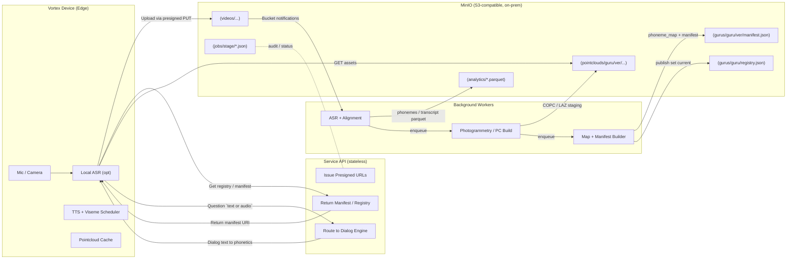
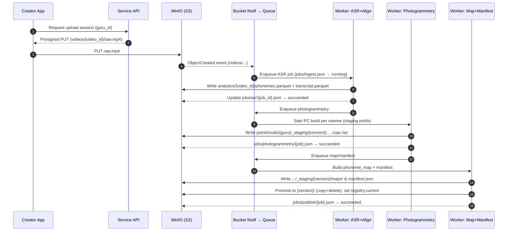
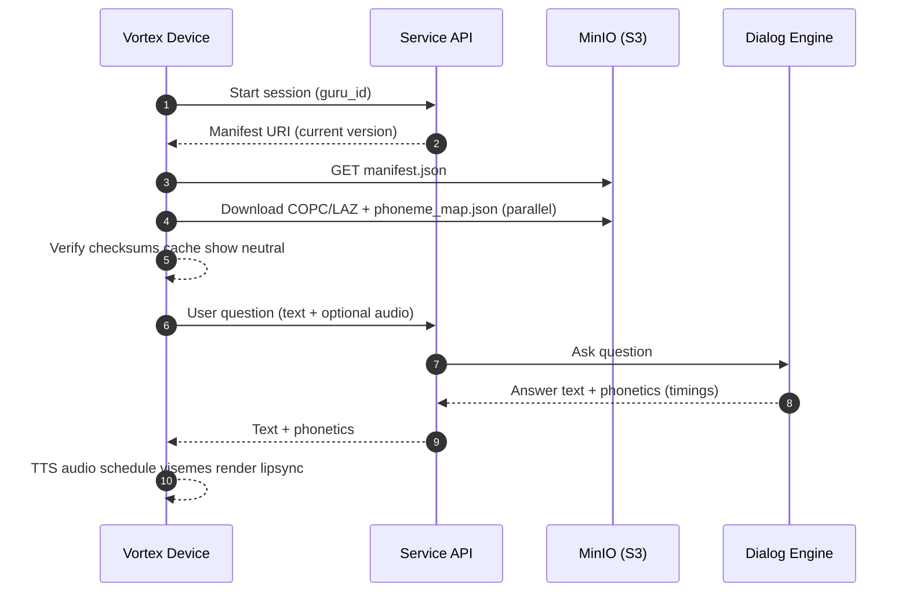
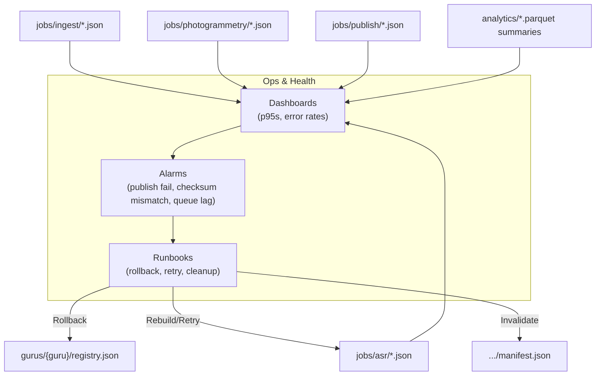
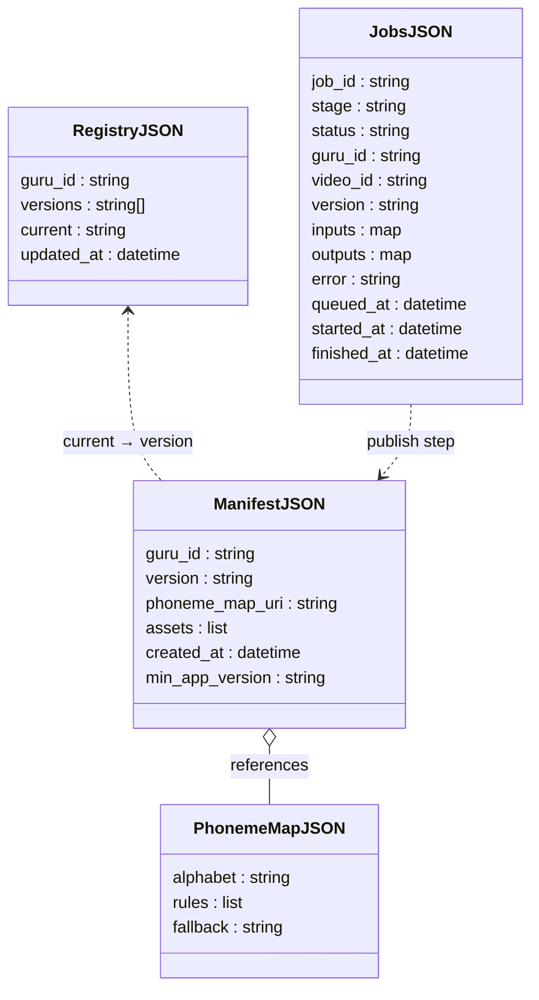
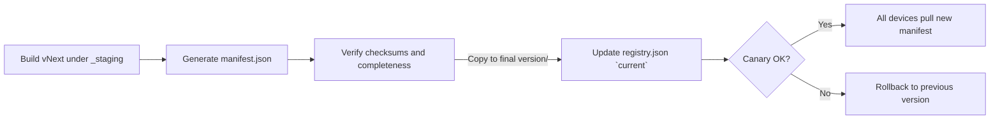

## High-level: components & contracts
#### ASR - Automatic Speech Recognition
- Converts spoken audio into text. 
- ASR takes the video’s audio track and produces a transcript aligned with timestamps. 
- Those timestamps later get matched to phonemes (the sounds of speech).

#### LAZ -Compressed LAS format
- LAS = an open standard binary format for storing 3D point cloud data. 
- LAZ = the lossless compressed version of LAS (using LASzip). 
- Much smaller size than raw LAS, but still precise. 
- Widely supported by tools like PDAL, CloudCompare, Potree, etc.

#### COPC - Cloud Optimized Point Cloud
- A newer specification that organizes LAZ point cloud data in a spatial hierarchy (octree). 
- Designed for streaming from object storage like S3. 
- Lets clients request only the parts of the point cloud they need (specific tiles / resolution), rather than downloading the whole file. 
- Very efficient for edge devices like your Vortex Guru since you can cache selectively.
- 

## Pipeline A — Creator upload → Build point-cloud guru

## Pipeline B — Customer runtime (run the guru)

## Pipeline C — Service provider ops & health

## Storage & control files (at-a-glance)

## Release flow (blue/green)

